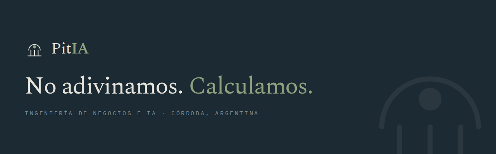

<p align="center">
  
</p>

<p align="center">
  <b>Diseñamos procesos. La IA los sostiene.</b><br>
  Sitio institucional de PitIA · <a href="https://pitia.com.ar">pitia.com.ar</a>
</p>

<p align="center">
  <a href="https://pitia.com.ar#contacto"><b>→ Pedir un diagnóstico</b></a>
</p>

---

## Qué hay acá

```
index.html            Sitio completo: HTML, CSS y JS en un solo archivo
og.png                Imagen que se muestra al compartir el link
assets/banner.png     Banner de marca
assets/fotos/         Fotos de las socias
netlify.toml          Configuración de publicación
```

Sin dependencias, sin compilación, sin `npm install`.

## Cómo modificar el contenido

Todo el texto está en `index.html`, con las secciones marcadas por
comentarios (`<!-- ══ HERO ══ -->`, `<!-- ══ MÉTODO ══ -->`).

Para cambios de texto: abrir el archivo → lápiz → editar → *Commit changes*.
Netlify publica solo, en menos de un minuto.

## Colores y tipografías

Declarados una sola vez en `:root`, al principio del `<style>`.

| Token | Color | Uso |
|---|---|---|
| `--ink` | `#1B2A33` | Texto principal, fondos oscuros |
| `--accent` | `#56684E` | Laurel: acentos, la respuesta |
| `--accent-lift` | `#8FA37F` | Laurel sobre fondo oscuro |
| `--paper` | `#F4F2EC` | Fondo principal |
| `--wash` | `#EAEEE3` | Fondo de secciones alternas |
| `--deep` | `#16221B` | Fondo de secciones oscuras |

Spectral (títulos) · Public Sans (texto) · IBM Plex Mono (etiquetas).

## Reglas de marca que afectan al código

- El nombre se escribe siempre `Pit<b>IA</b>`.
- El punto del isotipo nunca va arriba de la bóveda.
- El laurel se reserva para acentos, nunca como fondo de bloque.
- Toda animación respeta `prefers-reduced-motion`.

---

<table align="center">
<tr>
<td align="center" width="330">
<br><br>
<b>Ximena Moral</b><br>
<sub>DIRECCIÓN DE PROYECTOS E INFRAESTRUCTURA</sub><br><br>
<a href="https://www.linkedin.com/in/ximena-moral-383b2812">LinkedIn</a> ·
<a href="mailto:ximenamoral1971@gmail.com">Correo</a> ·
<a href="tel:+5493534025886">+54 9 353 402-5886</a>
</td>
<td align="center" width="330">
<br><br>
<b>Jime Fioni</b><br>
<sub>AUTOMATIZACIÓN E INTELIGENCIA ARTIFICIAL</sub><br><br>
<a href="https://www.linkedin.com/in/jimena-fioni">LinkedIn</a> ·
<a href="https://jimenafioni.carrd.co/">Portfolio</a> ·
<a href="mailto:jimenafioni@gmail.com">Correo</a>
</td>
</tr>
</table>

<p align="center">
  <sub><i>El oráculo son tus datos.</i></sub><br>
  <sub>PitIA — Ingeniería de negocios e IA · Córdoba, Argentina</sub>
</p>
